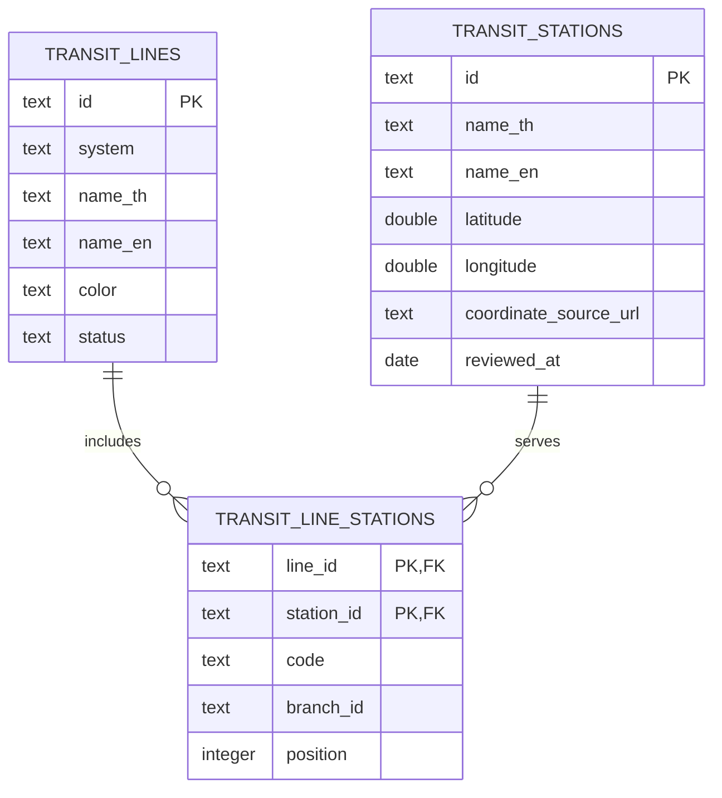

# Transit data: JSON now, database-ready later

Decision confirmed by the user on 18 September 2026: keep JSON for now. No database schema or production database data is changed by this release. These small, public reference datasets can be served with the website and searched without an extra API call.

## Canonical storage

| File under `src/data/` | Identity | Contents |
| --- | --- | --- |
| `thailandTransitLines.json` | `id` | System, Thai/English line names, aliases, display color, sort order, service status, source URL, review date, branch definitions |
| `thailandTransitStations.json` | `id` | System, Thai/English station names, aliases, latitude, longitude, service status, coordinate source, review date |
| `thailandTransitLineStations.json` | `(lineId, stationId)` | A station's code on that line, its branch and position along that branch |

The current snapshot contains 10 operating lines, 193 station records and 195 memberships. Counts are derived in the UI, not maintained separately. `src/lib/transitStations.ts` composes the previous `codes`/`lines` search shape from these relationships, so existing autocomplete, station URLs and map coordinates retain their stable IDs.

### Identity and geography

- IDs such as `bts-n5`, `mrt-bl20` and `srt-krung-thep-aphiwat` must remain stable even if a name changes. Keep former names as aliases.
- Siam belongs to two BTS lines through two membership rows. Krung Thep Aphiwat belongs to two Red lines with distinct RN01/RW01 codes. Never use the station name as the primary key.
- Same-name stations in separate systems remain separate locations. Memberships are not a walking-interchange routing graph; do not infer transfers or walking times from matching names.
- Coordinates are decimal WGS84 latitude/longitude for a station reference point. They are not individual entrances, walking distance, platform-to-platform routes or property coordinates. When migrating to PostGIS, construct points with **longitude first**, e.g. `ST_SetSRID(ST_MakePoint(longitude, latitude), 4326)`.
- Position is ordered within `(lineId, branchId)`. Pink MT01/MT02 are a separate `muang-thong-thani` branch connected at PK10; they are not consecutive stops after PK30. This catalog is not a journey-planning graph.
- Only reviewed operating lines are published. BRT is a bus service, not an electric-rail line. Planned provincial systems and unopened extensions are not presented as operating stations.

## Current connections

- `/all-transits`: select a line or search Thai/English names, aliases and codes. Unique exact station matches take precedence over partial names. Station cards link to the existing map; separate sale/rent links retain the chosen offer.
- `/properties/map?station=bts-n5&q=...`: stable station identity and coordinates, with existing map category/offer controls. This opens the station's map area; it does not claim a fixed walking-distance radius.
- Existing desktop/mobile/header/map autocomplete uses the same composed data. Source files do not need a database connection at runtime.
- Entry points appear under the home/rooms/business hero search, in the shared property footer, and in the sitemap.
- No listing or view counts are invented on station cards. Add them only when computed from published listing data with a documented distance rule.

## Refresh and validation

`node scripts/sync-transit-stations.cjs [snapshot-directory]` reads DRT and operator data and writes stations and memberships through `scripts/lib/transit-catalog.cjs`. Line metadata is reviewed separately, especially newly opened lines or branches. `TRANSIT_REVIEWED_AT=YYYY-MM-DD` can specify the review date for a saved snapshot. Otherwise the importer uses its run date; review the results before committing them.

Tests verify identities, every foreign-key reference, unique codes and positions within a line/branch, coordinate ranges, shared stations, branch order, reproducible normalization, all station map URLs, filters and empty-state reset. The existing station/autocomplete tests still run against the composed catalog.

Sources and source-specific caveats: [transit-station-catalog.md](transit-station-catalog.md). The [MRTA Pink branch page](https://www.mrta.co.th/th/pink-line-extension-si-rat---muang-thong-thani) confirms its connection at PK10. The LivingInsider reference page returned HTTP 403 during inspection; the user's screenshot informed the directory design. No logos, artwork or listing statistics were copied.

## Moving to PostgreSQL later

Create `transit_lines`, `transit_stations`, and `transit_line_stations` using the existing string IDs and membership keys. Enforce foreign keys, `UNIQUE(line_id, code)`, `UNIQUE(line_id, branch_id, position)`, positive positions, and valid coordinate ranges. Arrays can hold search aliases; branch definitions can initially use JSONB, or become a separate `transit_line_branches` table when routing/admin editing requires it. Keep service status, provenance and review dates.

For property proximity at larger scale, add a PostGIS `geography(Point,4326)` column and GiST index to station/property coordinates, and query published properties using `ST_DWithin`. Label distance as straight-line distance unless a walking-route service supplies the actual walking distance. Derive nearby stations from coordinates first; do not create an unmaintained station/property join just for display. Introduce a join only for reviewed manual associations or a deliberately maintained cache.

The first database-backed version can return the same composed catalog to the frontend, with the versioned JSON retained as a last-known snapshot. Add an admin editor only when there is a person/workflow maintaining the data. A database is not required for the directory or current autocomplete.
